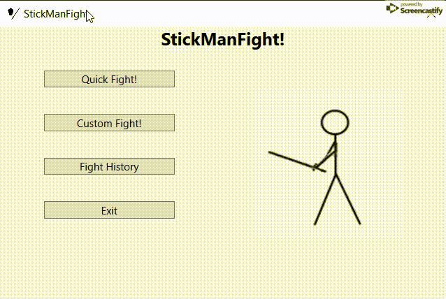

Denne WPF-applikation er inspireret af PlayStationspillet Tekken. Hvor 2 kan kæmpe imod hinanden.

Der er både mulighed for en "Quick Fight", hvor navne og stats er standard, 
samt mulighed for en "Custom Fight", hvor navne og stats indtastes manuelt.

For at gøre spillet sjovt er tastaturknapperne A og L bundet til angrebsknapperne over hver Fighter.

Samtidig bruges eventhandling og threading til at lave en nedtælling før angrebsknapperne aktiveres.

Det har jeg lært:
- C#
- WPF
- Event Handling
- Threading

